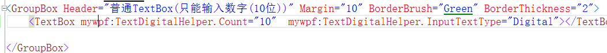

# 向大家分享在项目中编写的比较实用的控件：MyTextBox，对textbox进行了扩展
### lib文件夹中放的是控件的源码dll，该dll包含大量本人在这几年项目中的控件，现在逐步编写到github上，[github地址](https://github.com/y19890902q/MyWPFUI.git)
* Mask 水印提示
* MaskForeground 水印提示文字文字
* MaskFontSize 水印提示文字大小
* MaskHorizontalAlignment 水印提示横向对齐
* MaskVerticalAlignment 水印提示纵向对齐
* TextInputType 输入类型：Default（都可以）、Digital（纯数字）、Letter（纯字母）、InputMethodEnabled（关闭输入法）、DigitalWithOemPeriod（带小数点的数字）、DigitalWithMinus（有符号的数字）、DigitalWithMinusAndOemPeriod（有符号的数字，支持小数点）
* Units 小数位数（配合TextInputType的类型）
* IntCount 数字的位数（配合TextInputType的类型为纯数字）
* LeftContent 输入框左侧内容
* RightContent 输入框右侧内容
* TextDigitalHelper 是一个附加属性类，控制输入类型，可应用到普通的TextBox上
* ControlAttachPropertyHepler 是一个附加属性类（从网上的版本修改了很多），对网络图标字体进行了友好支持，详情看[MyWPFUIBaseDemo](https://github.com/y19890902q/MyWPFUIBaseDemo.git),以后会重点优化

```C#
 <Grid>
        <Grid.Resources>
            <Style TargetType="TextBox" BasedOn="{StaticResource {x:Type TextBox}}">
                <Setter Property="Height" Value="30"></Setter>
                <Setter Property="Margin" Value="10"></Setter>
                <Setter Property="BorderBrush" Value="#000000"></Setter>

            </Style>
            <Style TargetType="mywpf:MyTextBox" BasedOn="{StaticResource {x:Type mywpf:MyTextBox}}">
                <Setter Property="Height" Value="30"></Setter>
                <Setter Property="Margin" Value="10"></Setter>
                <Setter Property="BorderBrush" Value="#000000"></Setter>
            </Style>
        </Grid.Resources>

        <StackPanel>
            <GroupBox Header="MyTextBox的特性" Margin="10" BorderBrush="Green" BorderThickness="2">
                <StackPanel>
                    <mywpf:MyTextBox Mask="请在这里输入信息"></mywpf:MyTextBox>
                    <mywpf:MyTextBox TextInputType="Digital" Mask="只能输入数字(10位)" IntCount="10" MaskForeground="Red" MaskFontSize="15" MaskHorizontalAlignment="Right"></mywpf:MyTextBox>
                    <mywpf:MyTextBox TextInputType="DigitalWithMinus" Mask="只能输入正负数" MaskForeground="Green" MaskFontSize="17"></mywpf:MyTextBox>
                    <mywpf:MyTextBox LeftContent="%" RightContent="$" TextInputType="DigitalWithMinusAndOemPeriod" Mask="正负数（小数默认两位）" FontSize="15" ></mywpf:MyTextBox>
                    <mywpf:MyTextBox TextInputType="DigitalWithMinusAndOemPeriod" Mask="正负数（小数5位）" Units="5" FontSize="15" ></mywpf:MyTextBox>
                    <mywpf:MyTextBox  Mask="搜索模式" FontSize="15" MaskHorizontalAlignment="Center" CornerRadius="15" IsFocusSelectAll="True">
                        <mywpf:MyTextBox.RightContent>
                            <Image Source="pack://application:,,,/MyTextBox;component/Images/search.png" Width="16" Height="16" Cursor="Hand" Margin="0,0,5,0"></Image>
                        </mywpf:MyTextBox.RightContent>
                    </mywpf:MyTextBox>
                    <mywpf:MyTextBox  Mask="选择文件" FontSize="15"   IsFocusSelectAll="True">
                        <mywpf:MyTextBox.RightContent>
                            <mywpf:MyImageButton FontFamily="pack://application:,,,/MyTextBox;component/Resources/#myuifont"  Foreground="#f4ea2a" FontSize="20" Content="&#xe898;" VerticalAlignment="Center"
                                                 mywpf:ControlAttachPropertyHepler.IsOpenFileButtonBehaviorEnabled="True" Command="mywpf:ControlAttachPropertyHepler.OpenFileCommand" 
                                                 CommandParameter="{Binding RelativeSource={RelativeSource FindAncestor,AncestorType={x:Type TextBox}}}"></mywpf:MyImageButton>
                        </mywpf:MyTextBox.RightContent>
                    </mywpf:MyTextBox>
                    <mywpf:MyTextBox  Mask="选择文件路径" FontSize="15"   IsFocusSelectAll="True">
                        <mywpf:MyTextBox.RightContent>
                            <mywpf:MyImageButton FontFamily="pack://application:,,,/MyTextBox;component/Resources/#myuifont"  Foreground="#f4ea2a" FontSize="20" Content="&#xe898;" VerticalAlignment="Center"
                                                 mywpf:ControlAttachPropertyHepler.IsOpenFolderButtonBehaviorEnabled="True" Command="mywpf:ControlAttachPropertyHepler.OpenFolderCommand" 
                                                 CommandParameter="{Binding RelativeSource={RelativeSource FindAncestor,AncestorType={x:Type TextBox}}}"></mywpf:MyImageButton>
                        </mywpf:MyTextBox.RightContent>
                    </mywpf:MyTextBox>
                    <mywpf:MyTextBox  Mask="右侧有清除文本按钮" FontSize="15"   IsFocusSelectAll="True">
                        <mywpf:MyTextBox.RightContent>
                            <mywpf:MyImageButton FontFamily="pack://application:,,,/MyTextBox;component/Resources/#myuifont"  FontSize="20" Content="&#xe644;" VerticalAlignment="Center"
                                                 mywpf:ControlAttachPropertyHepler.IsClearTextButtonBehaviorEnabled="True" Command="mywpf:ControlAttachPropertyHepler.ClearTextCommand" 
                                                 CommandParameter="{Binding RelativeSource={RelativeSource FindAncestor,AncestorType={x:Type TextBox}}}"></mywpf:MyImageButton>
                        </mywpf:MyTextBox.RightContent>
                    </mywpf:MyTextBox>
                </StackPanel>
            </GroupBox>
            <Rectangle Fill="#000000" Height="1" Width="{Binding RelativeSource={RelativeSource AncestorType=StackPanel},Path=ActualWidth}" Margin="0,10"></Rectangle>
            <GroupBox Header="普通TextBox(只能输入数字(10位))" Margin="10" BorderBrush="Green" BorderThickness="2">
                <TextBox mywpf:TextDigitalHelper.Count="10"  mywpf:TextDigitalHelper.InputTextType="Digital"></TextBox>

            </GroupBox>
        </StackPanel>
    </Grid>
```
# 演示


